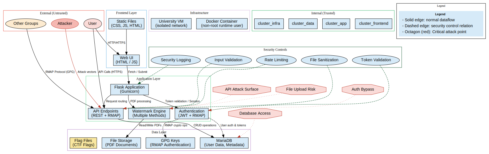

# Tatou Threat Model Documentation

> This document defines the security threat model of the Tatou PDF Watermarking Platform
> for the **Operational Security Specialization (Specialization D)**.
> It follows the **STRIDE methodology** and focuses on identifying, analyzing,
> and mitigating potential security threats in Tatou’s operational environment.

## Document Information
- **Created Date**: 09.27
- **Version**: 1.1
- **Specialization Lead**: Junyi
- **Last Updated**: 05.10

## 1. System Overview

### 1.1 System Architecture
Tatou is a Flask-based PDF watermarking management system with the following components:
- Flask Web Application Server (Gunicorn)
- MariaDB Database
- PDF Watermarking Module (Multiple algorithms)
- RMAP Authentication Protocol Module (GPG Encryption)
- File Storage System
- Docker Containerized Deployment

*Figure: High-level component and data flow diagram for Tatou.*

### 1.2 Key Data Flows
1. **User Authentication Flow**: User login → JWT token generation → API access control
2. **Document Processing Flow**: PDF upload → Watermark application → Version management → Link sharing
3. **RMAP Authentication Flow**: GPG encrypted handshake → Identity verification → Watermarked PDF generation
4. **Security Monitoring Flow**: Operation logs → Security event detection → Response handling

## 2. Asset Identification

### 2.1 Core Asset Inventory

|    Asset Type    |          Name         |                Description                 | Criticality |       Location        |
|------------------|-----------------------|-------------------------------- -----------|-------------|-----------------------|
| Data Asset       | User Credentials      | Usernames, password hashes, JWT tokens     |     High    | Database              |
| Data Asset       | PDF Documents         | Original and watermarked PDF files         |     High    | File System           |
| Data Asset       | Watermark Metadata    | Document versions, links, watermark keys   |     High    | Database              |
| Service Asset    | Flask Application     | Business logic and API endpoints           |     High    | Docker Container      |
| Service Asset    | MariaDB               | User and document metadata storage         |     High    | Docker Container      |
| Credential Asset | GPG Keys              | RMAP protocol encryption key pairs         |     High    | File System           |
| Security Asset   | Flag Files (3)        | CTF flags proving system compromise        |   Critical  | Container/File System |
| Config Asset     | Environment Variables | Database passwords, JWT secrets, etc.      |     High    | Environment Variables |
| Log Asset        | Application Logs      | Operation audit and security event records |    Medium   | File System           |

## 3. Threat Identification

### 3.1 Threat Analysis by Critical Attack Points

Based on the system architecture diagram, we identify four critical attack surfaces:

#### 3.1.1 API Attack Surface
**Threats:**
- Injection attacks (SQL, command)
- Broken authentication and session management
- Excessive data exposure
- Mass assignment vulnerabilities
- API rate limiting bypass

**Attack Vectors:**
- Malicious API requests
- Token theft or forgery
- Parameter manipulation

**Existing Controls:**
- Input validation and sanitization
- JWT token validation with client fingerprinting
- Rate limiting on authentication endpoints
- Parameterized SQL queries
- Centralized error handling with safe responses
- Structured security logging (for anomaly detection)

**Impact:**
Compromise of API endpoints could expose sensitive user data, allow unauthorized access, or disrupt service availability.

**Residual Risks:**
Advanced logic-based attacks (e.g., mass assignment), replay of valid JWTs, and potential zero-day API vulnerabilities remain partially mitigated.

#### 3.1.2 File Upload Risk  
**Threats:**
- Malicious file uploads (malware, scripts)
- PDF-specific attacks (embedded JavaScript, malformed structures)
- Path traversal attacks
- Watermark algorithm bypass

**Attack Vectors:**
- Malicious PDF files uploads
- File type spoofing through modified headers
- Attempts to remove or corrupt watermark metadata

**Existing Controls:**
- File type validation (PDF only, MIME type and signature)
- Secure filename handling and randomization
- Path traversal protection
- Multiple watermarking algorithms(redundancy-based)
- Sandbox PDF processing under restricted privileges

**Impact:**
Successful exploitation could lead to arbitrary code execution or unauthorized file access within the container environment.

**Residual Risks:**
Highly obfuscated or novel PDF exploits may bypass standard file validation; additional runtime scanning or sandboxing would further mitigate risk.

#### 3.1.3 Database Access
**Threats:**
- SQL injection attacks
- Credential leakage or reuse
- Unauthorized data exfiltration
- Data tampering or privilege escalation

**Attack Vectors:**
- Exploiting unsanitized query parameters
- Application-level privilege escalation
- Credential theft via misconfigured environment variables

**Existing Controls:**
- Parameterized queries
- Database isolation in container(no external port exposure)
- Limited privileges for database user
- Regular credential rotation
- Encrypted environment variables for DB credentials

**Impact:**
Database compromise could lead to user data leakage, manipulation of watermark metadata, or total service corruption.

**Residual Risks:**
If application logic is compromised, attackers may indirectly access data via legitimate queries. Further role-based access controls (RBAC) may reduce this risk.

#### 3.1.4 Authentication Bypass
**Threats:**
- JWT token manipulation or forgery
- RMAP protocol exploitation
- Session hijacking
- Privilege escalation or impersonation

**Attack Vectors:**
- Token forgery or replay
- GPG key compromise
- Exploiting protocol implementation flaws

**Existing Controls:**
- JWT signature verification and expiration
- Short-lived tokens bound to device fingerprint
- GPG encryption for RMAP protocol
- - Centralized session validation
- Secure logging of failed login attempts

**Impact:**
Authentication bypass may grant full access to restricted endpoints or allow impersonation of legitimate users.

**Residual Risks:**
Compromise of cryptographic keys or inadequate token revocation could still enable persistent unauthorized access. Continuous key rotation and audit logging are recommended.

#### 3.1.5 Attack Tree Analysis

The following attack trees and sequences are included in `docs/attack_trees/`:

- API attack tree: `docs/attack_trees/api_attack_tree.dot` (rendered svg: `api_attack_tree.svg`)
- Authentication bypass sequence: `docs/attack_trees/auth_bypass_sequence.txt`
- File upload attack tree: `docs/attack_trees/file_upload_attack_tree.dot` (rendered svg: `file_upload_attack_tree.svg`)
- File upload sequences: `docs/attack_trees/file_upload_sequence.txt`

These artifacts provide visual and sequential representations of likely attack paths and detection points to help prioritize mitigations and monitoring.

### 3.2 Specific Threat Scenarios(STRIDE Framework)

|      STRIDE Category       |                  Threat Scenario                 |          Potential Impact           |           Attack Vector            |
|----------------------------|--------------------------------------------------|-------------------------------------|------------------------------------|
| **S**poofing               | Forge RMAP identity to impersonate other groups  | Illegal access to watermarked PDFs  | GPG key compromise                 |
| **S**poofing               | JWT token forgery or theft                       | Unauthorized access to user data    | Token leakage                      |
| **T**ampering              | Modify database watermark records                | Compromise watermark tracking chain | SQL injection                      |
| **T**ampering              | Modify stored PDF files                          | Destroy watermark integrity         | File upload vulnerability          |
| **R**epudiation            | User denies watermark creation operation         | Cannot trace leakage source         | Missing logs                       |
| **I**nformation Disclosure | Access other users' documents via API            | Confidential information leakage    | Privilege escalation               |
| **I**nformation Disclosure | Container flag file leakage                      | Course grading impact               | Container escape                   |
| **D**enial of Service      | Exhaust resources with PDF watermarking requests | Service unavailable                 | Resource exhaustion                |
| **D**enial of Service      | Exhaust database connection pool                 | API unresponsive                    | Connection flood                   |
| **E**levation of Privilege | Regular user gains admin privileges              | Full system control                 | Privilege escalation vulnerability |

### 3.3 Risk Evaluation Matrix

This section summarizes the identified threats based on their **likelihood**, **impact**, and **current control status**
The scores are rated from **1 (Low)** to **5 (Critical)**, and the total risk is calculated as **Likelihood × Impact**

|    Attack Surface      |                Threat Summary               | Likelihood (1–5) | Impact (1–5) |       Risk Level     |                 Existing Controls                    |   Residual Risk    | Priority |
|------------------------|---------------------------------------------|------------------|--------------|----------------------|------------------------------------------------------|--------------------|----------|
| API Attack Surface     | Injection, token forgery, rate limit bypass |         3        |       5      |       15 (High)      | Input validation, JWT checks, rate limiting          | Partial mitigation |   High   |
| File Upload Risk       | Malicious PDF uploads, watermark bypass     |         3        |       4      |   12 (Medium-High)   | File type check, sandbox, path protection            | Partial mitigation |  Medium  |
| Database Access        | SQLi, credential leakage, tampering         |         2        |       5      |      10 (Medium)     | Parameterized queries, isolation, limited privileges |         Low        |  Medium  |
| Authentication Bypass  | Token replay, GPG compromise                |         2        |       5      |      10 (Medium)     | JWT expiry, GPG encryption, fingerprint binding      |       Moderate     |  Medium  |
| Denial of Service      | Resource exhaustion (PDF processing)        |         3        |       3      |       9 (Medium)     | Basic rate limiting, container resource limits       |       Moderate     |  Medium  |
| Information Disclosure | Unauthorized access to documents            |         2        |       4      |       8 (Medium)     | Access control, logging                              |         Low        |    Low   |
| Repudiation            | User denies watermark creation              |         1        |       3      |       3 (Low)        | Structured audit logs                                |      Negligible    |    Low   |
| Elevation of Privilege | User gains admin privileges                 |         1        |       5      |       5 (Medium)     | Role-based control planned                           |         Low        |    Low   |

**Interpretation:**
- **High-risk items (≥12)**: Require continuous monitoring and additional mitigation (API, File Uploads)
- **Medium-risk items (8–11)**: Acceptable under current controls but should be periodically reviewed
- **Low-risk items (≤7)**: Residual risk is within tolerance for current environment

-------

## 4. Risk Analysis

### 4.1 Current Risk Status

Risk Level = Likelihood × Impact (1–25 scale)

|        Threat Name          | Likelihood (1-5) | Impact (1-5) | Risk Level | Priority |        Status       |
|-----------------------------|------------------|--------------|------------|----------|---------------------|
| RMAP Identity Spoofing      |         3        |      4       |     12     |  Medium  |      Monitoring     |
| JWT Token Security Issues   |         2        |      5       |     10     |  Medium  |       Hardened      |
| Watermark Algorithm Bypass  |         3        |      3       |      9     |  Medium  |  Testing Required   |
| File Upload Vulnerabilities |         2        |      4       |      8     |  Medium  |        Fixed        |
| SQL Injection Attacks       |         1        |      5       |      5     |    Low   |        Fixed        |
| Deserialization Attacks     |         1        |      5       |      5     |    Low   |        Fixed        |
| Container Escape Attacks    |         2        |      5       |     10     |  Medium  |      Monitoring     |
| DDoS Attacks                |         4        |      3       |     12     |  Medium  | Partially Protected |

## 5. Mitigation Measures

### 5.1 Implemented Measures

|          Threat         |             Mitigation Measures                 | Implementation Status |  Verification Method  |
|-------------------------|------------------------------------------- -----|-----------------------|-----------------------|
| SQL Injection           | Parameterized queries + Input validation        |      Implemented      | Code review + Testing |
| File Upload Attacks     | File type validation + Path security            |      Implemented      | Penetration testing       |
| Deserialization Attacks | Removed pickle/dill plugin loading              |      Implemented      | Code review           |
| JWT Security Issues     | Short-lived tokens + Client fingerprinting      |      Implemented      | Token analysis        |
| Weak Password Policy    | Password strength requirements + Hash hardening |      Implemented      | Policy validation     |
| Container Security      | Non-root user execution + Resource limits       |      Implemented      | Container inspection  |
| Logging & Monitoring    | Structured logging + Security event tracking    |      Implemented      | Log analysis          |

### 5.2 Planned Measures

|             Threat           |                     Planned Mitigation             | Priority | Timeline |
|------------------------------|----------------------------------------------------|----------|----------|
| RMAP Identity Spoofing       | Enhanced GPG key management + Session monitoring   |  Medium  |  Phase 3 |
| Watermark Algorithm Security | Watermark strength testing + Anti-removal analysis |  Medium  |  Phase 3 |
| Advanced DDoS Protection     | API rate limiting + Request filtering              |  Medium  |  Phase 3 |
| Real-time Alerting           | Automated security event notifications             |  Medium  |  Phase 3 |

---

## 6. Appendix

### 6.1 Methodologies
- **STRIDE Framework** (Microsoft Threat Modeling)
- **OWASP Threat Modeling** (Web Application Threat Modeling)
- **NIST SP 800-30** (Risk Assessment Guide)

### 6.2 Reference Standards
- OWASP Top 10 2021
- CIS Docker Security Benchmark
- NIST Cybersecurity Framework

### 6.3 Assumptions and Constraints
- Attackers are primarily other course groups
- VM environment is relatively isolated but not completely secure
- Some dependency components have known vulnerability risks

### 6.4 Document Change History
| Version | Date  |                         Changes                         | 
|---------|-------|---------------------------------------------------------|
|   1.0   | 30.09 |           Initial threat model document                 |
|   1.1   | 03.10 | Added architecture diagram and detailed threat analysis |
